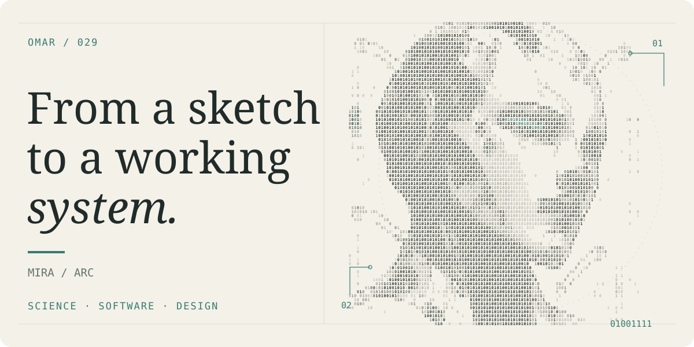
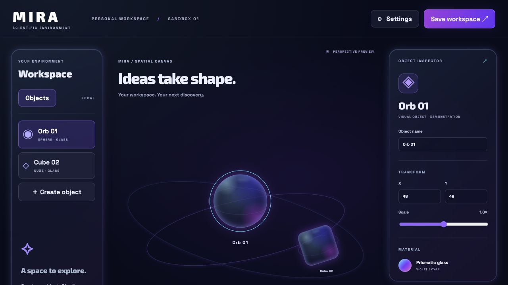
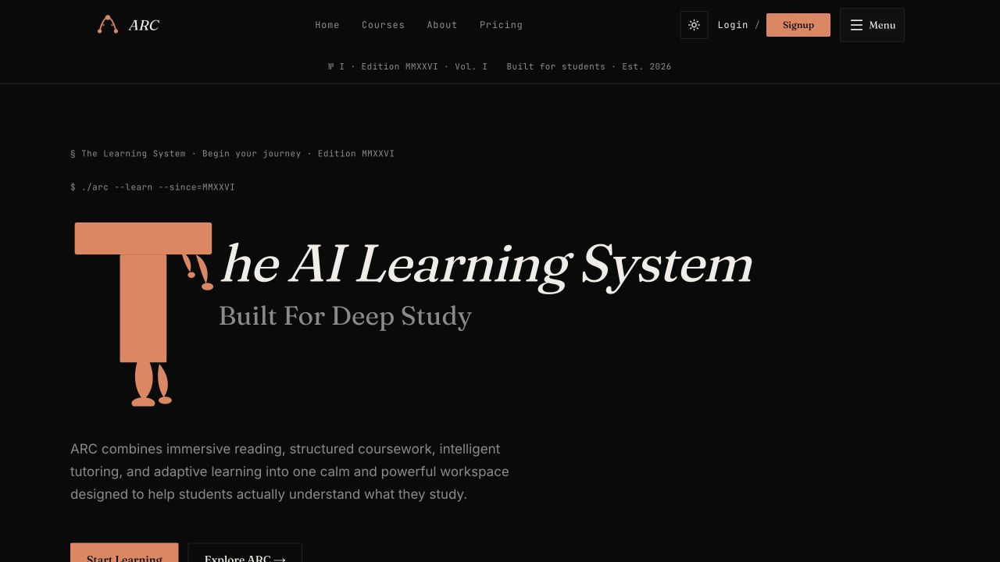

## Hi, I'm Omar.

I turn complex ideas into thoughtful, approachable software. Currently building **MIRA**, a visual research workspace, and **ARC**, an AI-assisted learning system.

**[Explore my portfolio ↗](https://omarsportfolio.me/)** &nbsp; · &nbsp; [MIRA](#01--mira) &nbsp; · &nbsp; [ARC](#02--arc)

---

## 01 / MIRA

**A space for ideas to take shape.**

A scientific workspace prototype exploring visual objects, computational models, and more intuitive ways to interact with research.

DESIGN PROTOTYPE · IN DEVELOPMENT

The preview shows the visual design sandbox. Scientific models and hand tracking are not connected to this preview.

**[Explore MIRA ↗](https://github.com/oabdelrazek29/mira-demo)**

---

## 02 / ARC

**Make complex material click.**

An AI-assisted learning workspace that brings courses, tutoring, notes, and visual knowledge maps into one focused place.

WEB APPLICATION · IN ACTIVE DEVELOPMENT

**[Visit ARC ↗](https://my-app-eta-nine-83.vercel.app/)** &nbsp; · &nbsp; [Explore the code](https://github.com/oabdelrazek29/ARC)

---

### What connects the work

Curiosity about how people learn. Care for how tools feel. A habit of turning an idea into something you can explore.

FROM A SKETCH TO A WORKING SYSTEM.
